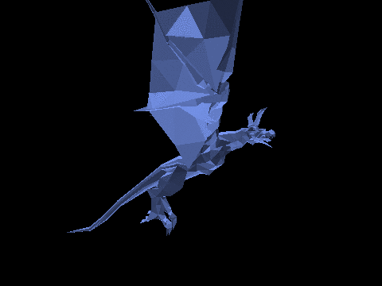
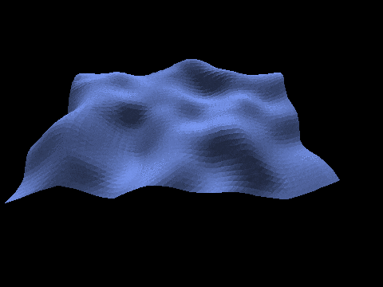
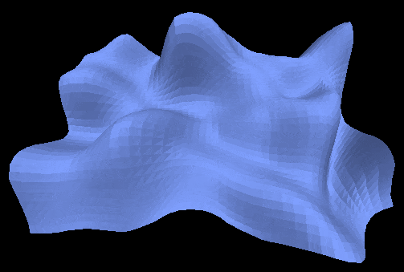

# Overview

This project is an implementation of a software rasterizer, meaning it renders 3D objects (triangles) to a 2D space, purely on the CPU and without using libraries such as DirectX or Vulkan.
The only available tools are a color buffer, and a mean to present it on screen.

**Disclaimer:** Before you insult me, this is a project I made back in 2002, to explore how all this works and for fun. Many things are poorly designed and this repository doesn't even pretend to be educational, there are many good resources for that on the web.

 
*A dragon rotating on 3 axis, with a light rotating around.*
  

 
*A terrain map rotating around the Y axis, with a light rotating around in the opposite direction.*
  

 
*Another terrain map, with a light rotating around.*

# How it works

There are plenty of different techniques to render a 3D model, hereafter is an explanation about how this project is implemented.

## 1. Load a 3D model

Here I used the `ASE` file format because it it very easy to parse. `ASE` stands for **AS**cii **E**xport. It is very size-inefficient, but easy to understand and parse, since it is human-readable.

A model is made of triangles, and triangles are made on vertices. First the list of vertices is loaded, then the triangles are loaded, because a triangle is actually three indices pointing to the vertices it uses. For example, a square will have four vertices and only two triangles, a triangle using vertices 1, 2 and 3, the other triangle using vertices 2, 3 and 4.

## 2. Compute normal vectors

A [normal vector][1] is a vector that indicates how a triangle is oriented in space. Because the [normal vectors][1] are related to the structure of the model, and the structure of the model is never modified at runtime, the [normal vectors][1] can be pre-computed and stored in memory. Computing a [normal vector][1] can be expensive, so this is something you want to avoid doing for each rendered frame.

The [normal vector][1] is computed using a [cross product][2] and will be necessary to compute the lighting coefficient of the triangle.

In the current implementation, there is no [back face culling][5], so the orientation of the vector does not really matter.

## 3. Transform the model

The original structure of the model always remain unchanged. Instead, a transformed copy is created for each frame, and this is the one being rendered.
It allows to apply a new transform each time based on the original unchanged model, and thus avoid to accumulate errors by keeping transforming the original model.

Translation and scaling are cheap transforms, but [rotations][6] are expensive because they require a lot of cosine and sine function calls as well as many multiplications. For this reason, transforms are often done using [matrices][3] because they can store pre-computed values that will apply to all vertices, and thus saving a lot of operations. The other benefit of [matrices][3] is their capability to compose multiple transforms.

Note that the model's [normal vectors][1] also have to be transformed if you want the model to be lit in world space.

## 4. Handle occlusion

Here by occlusion I mean, avoid rendering triangles that are behind other triangles. Usually a good rendering technique uses a [Z buffer][4], but here I used an inefficient but simple technique, which consists of drawing all the triangles, from back to front in depth order. This wastes CPU cycles, but is fairly easy to implement and does the trick.

For that, triangles are [sorted](https://en.wikipedia.org/wiki/Quicksort) based on their average Z position. Normally, the camera position should be taken into account because the depth of a triangle is relative to the camera, not some random point in space. The position of the camera is not taken into account here, which is bad, but it works because the camera does not move. If it would, the render would be completely broken.

## 5. Compute shading

The [shading][7] here is not about shadow casting, but about how a model is lit. For each triangle of the model, its [normal vector][1] and the position of the light, both in world space, are used to compute the lighting. There are several different [shading][7] (lighting) techniques, and here the flat [shading][7] is used for its extreme simplicity.

In flat [shading][7], all pixels of a triangle have the same lighting coefficient, and that coefficient is a ratio based on the angle between the triangle orientation, represented by its [normal vector][1], and the light position, represented by the lighting vector, which is the vector directed from the light toward the triangle. When lighting is parallel to the triangle, the coefficient is zero and the triangle is not lit. When lighting is perpendicular to the triangle, the coefficient is one and the triangle is fully lit. The coefficient can be adjusted to be smoothened or produce specular lighting effect with non-linear adjustment.

Eventually, the model color is multiplied with this coefficient in order to produce a new color that represents the lit triangle. The major drawback with flat [shading][7] is that it is terribly ugly.

## 6. Prepare scanline

For each triangle, the first step to perform is to [project][8] it from 3D space to 2D space. There are different [projection][8] techniques such as orthographic or perspective, here I used a dirty custom and cheap projection computation.

Once 2D coordinates are determined for each vertex of the triangle, lines are drawn between the 2D coordinates. This line drawing function does not draw to screen, instead it fulfills a buffer keeping track of the X coordinate (min and max) for each given Y coordinate of the lines. Once the three lines of the triangle are plotted, the buffer contains a pair of minimum and maximum X coordinate for each Y coordinate.

## 7. Fill the color buffer

For each Y line of the buffer fulfilled at the prepare scanline stage and the color computed at the shading phase, scan from the minimum X to the maximum X and set the color buffer at position X and Y with the final computed color.

Repeat stages 5, 6 and 7 for all triangles of the model. When all this is done, the color buffer can be presented to screen.

# Build

The project files are setup for Visual Studio 2019 Community Edition. 
Note that you must have installed the C++ workload.

I've tested with Visual Studio 2017 Community Edition as well and it works, you just have to tweak `Windows SDK Version` and `Platform Toolset` parameters according to your context in the project settings to get it building.

# Possible future work

- Implement a [Z buffer][4]
- Implement [Gouraud](https://en.wikipedia.org/wiki/Gouraud_shading) or [Phong](https://en.wikipedia.org/wiki/Phong_shading) shading
- Linux / MacOS implementations

[1]: https://en.wikipedia.org/wiki/Normal_(geometry)
[2]: https://en.wikipedia.org/wiki/Cross_product
[3]: https://en.wikipedia.org/wiki/Transformation_matrix
[4]: https://en.wikipedia.org/wiki/Z-buffering
[5]: https://en.wikipedia.org/wiki/Back-face_culling
[6]: https://en.wikipedia.org/wiki/Rotation_matrix
[7]: https://en.wikipedia.org/wiki/Shading
[8]: https://en.wikipedia.org/wiki/3D_projection
